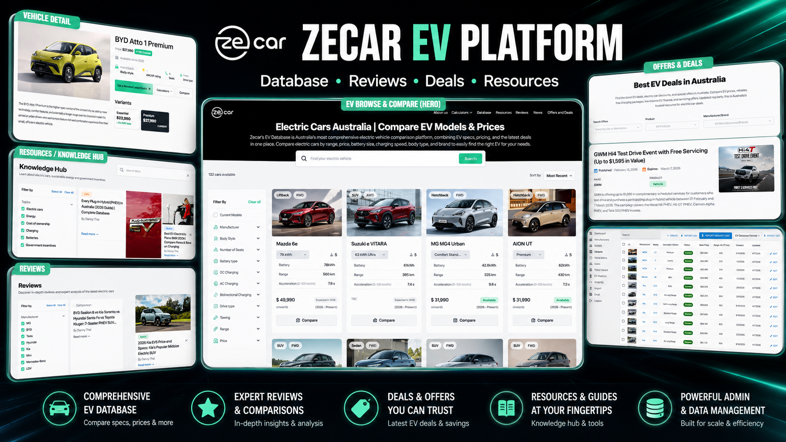
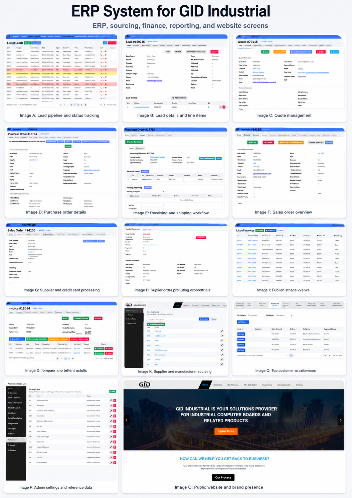

# Rafael Kaznadii

### Full-Stack · Backend · Mobile · Data · WebGL Developer

I build practical software for complex business workflows, structured data, responsive web products, Android and iOS applications, and interactive browser experiences.

**Kryvyi Rih, Ukraine · Available for remote work · English and Ukrainian**

---

## Portfolio Navigation

| Destination | Direct link |
|---|---|
| **Main portfolio / index** | [Open website](https://rafaelkaznadii-glitch.github.io/intro/) |
| **About Rafael** | [Open About](https://rafaelkaznadii-glitch.github.io/intro/#about) |
| **All selected projects** | [Open Projects](https://rafaelkaznadii-glitch.github.io/intro/#projects) |
| **GID Industrial ERP** | [Open GID project](https://rafaelkaznadii-glitch.github.io/intro/#gid-industrial) |
| **Zecar EV platform** | [Open Zecar project](https://rafaelkaznadii-glitch.github.io/intro/#zecar) |
| **Mobile development** | [Open Mobile](https://rafaelkaznadii-glitch.github.io/intro/#mobile) |
| **Professional experience** | [Open Experience](https://rafaelkaznadii-glitch.github.io/intro/#experience) |
| **Technical skills** | [Open Skills](https://rafaelkaznadii-glitch.github.io/intro/#skills) |
| **Résumé, CV, and portfolio PDFs** | [Open Documents](https://rafaelkaznadii-glitch.github.io/intro/#documents) |
| **Contact** | [Open Contact](https://rafaelkaznadii-glitch.github.io/intro/#contact) |

---

## About Rafael

Rafael Kaznadii is a **full-stack and mobile developer with 9+ years of software-development experience**. His work covers the full product lifecycle: understanding business processes, designing APIs and data flows, building backend systems, creating responsive interfaces, integrating databases, processing large datasets, developing mobile applications, and delivering production-ready products.

<table>
  <tr>
    <td align="center"><strong>9+ years</strong> Full-stack development</td>
    <td align="center"><strong>4 years</strong> Python</td>
    <td align="center"><strong>3 years</strong> Android</td>
    <td align="center"><strong>2 years</strong> iOS / iPhone</td>
    <td align="center"><strong>3 years</strong> Java</td>
  </tr>
</table>

### Core strengths

- Full-stack web application development
- C# and ASP.NET backend engineering
- Node.js, Express.js, REST APIs, and database integration
- Python scraping, crawling, extraction, cleaning, standardization, and normalization
- ERP, product-information, marketplace, and e-commerce systems
- Android and iOS / iPhone application development
- Responsive UI development with React, Next.js, TypeScript, and Tailwind CSS
- WebGL, Three.js, Babylon.js, PixiJS, GSAP, and browser-based interactive experiences
- AWS, Git, GitHub, deployment workflows, production support, and remote collaboration

---

## Featured Project: Zecar EV Platform

**Role:** Full-Stack and Mobile Developer  
**Product:** Electric-vehicle discovery, comparison, content, offers, and marketplace platform for Australia

Zecar combines structured electric-vehicle data with consumer-facing discovery tools and internal administration. The platform brings together EV specifications, pricing, comparisons, reviews, resources, offers, and data-management workflows in one responsive product.

### Product areas

- Searchable electric-vehicle catalogue
- Filters, sorting, and comparison-ready vehicle cards
- Vehicle model, variant, price, range, charging, and performance information
- EV reviews and expert comparisons
- Knowledge hub, guides, news, and educational resources
- Offers, deals, and promotional journeys
- Administrative data-management tools
- Responsive web application development
- Android and iOS / iPhone mobile application development

### Zecar technologies and skills

| Area | Technologies and capabilities |
|---|---|
| **Frontend** | React.js, Next.js, TypeScript, JavaScript, Tailwind CSS, responsive UI, user-interface development |
| **Backend** | Node.js, REST APIs, backend development, database development, system integration |
| **Product and data** | Structured vehicle data, searchable catalogues, filtering, comparison tools, marketplace development, e-commerce |
| **Mobile** | Mobile application development, Android, iOS / iPhone |
| **Delivery** | Full-stack development, web application development, product-focused engineering, production support |

[**Open the Zecar project on the live portfolio →**](https://rafaelkaznadii-glitch.github.io/intro/#zecar)

---

## Featured Project: GID Industrial ERP

**Role:** C# / ASP.NET Backend Developer · Product Data Engineer · Mobile Application Developer  
**Product:** Industrial ERP, sourcing, finance, reporting, product-data, and website platform

GID Industrial is a broad operational system connecting sales, procurement, inventory, supplier workflows, invoicing, reporting, product information, administration, and public website functions.

### Business and ERP workflows

- Lead pipeline and status tracking
- Lead details and line-item management
- Quote creation and management
- Purchase-order details and approval workflows
- Receiving and shipping operations
- Sales-order management
- Supplier and credit-card processing
- Supplier orders and purchasing opportunities
- Invoice lists, invoice details, payments, and credits
- Customer, revenue, profitability, and financial reporting
- Supplier and manufacturer sourcing
- Administrative settings, industries, permissions, and reference data
- Public website and brand presence

### Data engineering and product information

- Python-based web scraping and crawling
- Collection and processing of millions of industrial product records
- Data extraction, cleaning, standardization, and normalization
- Product-data integration and mapping
- Database design and backend data workflows
- Product Information Management capabilities
- Supplier and manufacturer data organization
- Reporting and operational analytics support

### GID technologies and skills

| Area | Technologies and capabilities |
|---|---|
| **Core backend** | C#, ASP.NET, Node.js, Express.js, TypeScript, REST APIs, backend development |
| **Data engineering** | Python, web scraping, web crawling, data extraction, data cleaning, data integration, data normalization |
| **Business systems** | ERP, database design, sales workflows, purchasing, inventory, finance, reporting, administration |
| **Product information** | Product Information Management, supplier data, manufacturer data, structured industrial product records |
| **Mobile** | Mobile application development, Android, iOS / iPhone |
| **Delivery** | System integration, production support, business-process implementation, remote collaboration |

[**Open the GID Industrial project on the live portfolio →**](https://rafaelkaznadii-glitch.github.io/intro/#gid-industrial)

---

## Mobile Development

Rafael has confirmed experience developing mobile applications for **Android and iPhone/iOS**, including product work connected to **GID Industrial, Gideon, and Zecar**.

- **Android development:** 3 years
- **iOS / iPhone development:** 2 years
- **Java:** 3 years
- Product-focused application development
- Mobile UI and application workflows
- Integration with web products, backend systems, APIs, and structured data

The portfolio intentionally avoids claiming a specific native or cross-platform framework, toolchain, or app-store publishing process until those implementation details are separately confirmed.

[**Open the mobile-development section →**](https://rafaelkaznadii-glitch.github.io/intro/#mobile)

---

## Technical Stack

### Frontend and UI

`JavaScript` `TypeScript` `React.js` `Next.js` `HTML5` `CSS3` `Tailwind CSS` `Responsive Web Design` `Webflow` `Framer`

### Backend, APIs, and databases

`C#` `ASP.NET` `Node.js` `Express.js` `REST APIs` `Database Design` `System Integration` `Backend Development`

### Python and data engineering

`Python` `Web Scraping` `Web Crawling` `Data Extraction` `Data Cleaning` `Data Standardization` `Data Integration` `Data Normalization` `Product Information Management`

### Mobile

`Android Development` `iOS / iPhone Development` `Java` `Mobile Application Development` `Product Delivery`

### WebGL and interactive development

`WebGL` `Three.js` `Babylon.js` `PixiJS` `GSAP` `Lottie.js` `Interactive 3D` `Browser Animation`

### Cloud, source control, and delivery

`Git` `GitHub` `AWS` `Deployment Workflows` `Architecture` `Production Support` `Client Communication`

### Creative production tools

`Photoshop` `After Effects` `Adobe Animate` `Blender`

[**View the complete skills section →**](https://rafaelkaznadii-glitch.github.io/intro/#skills)

---

## Professional Experience

| Period | Role | Main focus |
|---|---|---|
| **2017 — Present** | **Full-Stack Developer · Freelance / Remote** | End-to-end web applications, C#/ASP.NET, Node.js/Express APIs, databases, mobile application development, AWS deployment, and client delivery |
| **Recent** | **C# / ASP.NET Backend Developer · GID Industrial** | ERP workflows, operational reporting, industrial product-data systems, Python data-acquisition pipelines, and mobile development |
| **2023 — 2024** | **HTML5 Animator · PureRed** | HTML5, JavaScript, GSAP, Three.js, PixiJS, Lottie.js, and interactive campaigns |
| **2021 — 2023** | **WebGL Developer · Haddad and Partners** | Interactive 3D web experiences and product configurators using WebGL, Three.js, Babylon.js, PixiJS, and GSAP |

[**Open the experience timeline →**](https://rafaelkaznadii-glitch.github.io/intro/#experience)

---

## Documents

| Document | Link |
|---|---|
| **Résumé** | [Open Rafael_Kaznadii_Resume.pdf](https://rafaelkaznadii-glitch.github.io/intro/assets/docs/Rafael_Kaznadii_Resume.pdf) |
| **Detailed CV** | [Open Rafael_Kaznadii_CV.pdf](https://rafaelkaznadii-glitch.github.io/intro/assets/docs/Rafael_Kaznadii_CV.pdf) |
| **Printable portfolio** | [Open Rafael_Kaznadii_Portfolio.pdf](https://rafaelkaznadii-glitch.github.io/intro/assets/docs/Rafael_Kaznadii_Portfolio.pdf) |
| **Documents section** | [Open all documents](https://rafaelkaznadii-glitch.github.io/intro/#documents) |

---

## Contact

Rafael is available for remote opportunities involving full-stack development, backend engineering, C# / ASP.NET, data engineering, ERP systems, mobile applications, marketplaces, and interactive web experiences.

- **Email:** [rafael.kaznadii@gmail.com](mailto:rafael.kaznadii@gmail.com)
- **LinkedIn:** [Rafael Kaznadii](https://www.linkedin.com/in/rafael-kaznadii-0a0b97382)
- **Phone:** [+380 98 951 6059](tel:+380989516059)
- **Live portfolio:** [rafaelkaznadii-glitch.github.io/intro](https://rafaelkaznadii-glitch.github.io/intro/)
- **GitHub repository:** [github.com/rafaelkaznadii-glitch/intro](https://github.com/rafaelkaznadii-glitch/intro)

### Building useful software from complex workflows and data.

