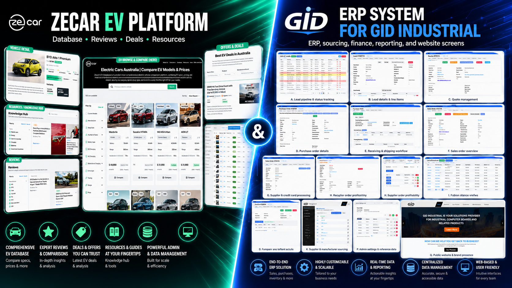

# Hi, I'm Rafael Kaznadii

### Full-Stack & Backend Developer · Mobile Developer · Data Engineer · WebGL Developer

I build production software that turns complex business processes, large datasets, and product ideas into reliable web and mobile applications.

**Kryvyi Rih, Ukraine · Available for remote opportunities · English and Ukrainian**

---

## About Me

I'm a **full-stack and backend developer with 9+ years of experience** building production web applications, business systems, data pipelines, mobile applications, and interactive browser experiences.

My work usually sits where software engineering meets real business operations. I translate workflows into maintainable systems, design APIs and data models, build responsive interfaces, integrate third-party services, process large product datasets, and support applications after launch.

I have worked on:

- Enterprise ERP and operations software
- Product-information and industrial data platforms
- Searchable marketplaces and e-commerce products
- Android and iOS applications
- Python scraping, crawling, and data-processing pipelines
- WebGL and interactive browser experiences
- Remote client delivery from planning through production support

<table>
  <tr>
    <td align="center"><strong>9+ years</strong> Full-stack development</td>
    <td align="center"><strong>6 years</strong> React / Next.js</td>
    <td align="center"><strong>5 years</strong> TypeScript</td>
    <td align="center"><strong>4 years</strong> Python</td>
    <td align="center"><strong>3 years</strong> Android</td>
    <td align="center"><strong>2 years</strong> iOS</td>
  </tr>
</table>

---

## Featured Work

### Zecar EV Platform

**Role:** Full-Stack & Mobile Developer  
**Product:** Electric-vehicle database, comparison, reviews, resources, deals, and administration platform for Australia

Zecar brings structured EV data and consumer-facing tools into one responsive product. I contributed across the web platform, backend workflows, data presentation, product discovery, administration, and mobile application development.

**Key product areas**

- Searchable electric-vehicle catalogue
- Vehicle filters, sorting, and side-by-side comparisons
- Model and variant pages with price, range, charging, and performance data
- Reviews, expert comparisons, articles, guides, and knowledge resources
- Offers and promotional journeys
- Administrative tools for vehicle and content data
- Responsive web experiences
- Android and iOS application development

**Technology and capabilities**

`React.js` `Next.js` `TypeScript` `JavaScript` `Node.js` `REST APIs` `Tailwind CSS` `Responsive UI` `Structured Data` `Database Integration` `Marketplace Development` `Android` `iOS`

[**Explore Zecar on my portfolio →**](https://rafaelkaznadii-glitch.github.io/intro/#zecar)

---

### GID Industrial ERP System

**Role:** C# / ASP.NET Backend Developer · Product Data Engineer · Mobile Application Developer  
**Product:** ERP, sourcing, purchasing, finance, reporting, product-information, administration, and website platform

GID Industrial is an operational software ecosystem connecting sales, purchasing, suppliers, inventory, invoicing, reporting, product data, administration, and public website workflows.

**Business and ERP workflows**

- Lead pipelines and status tracking
- Lead details and line-item management
- Quote creation and management
- Purchase orders, receiving, and shipping
- Sales-order workflows
- Supplier and manufacturer management
- Invoice, payment, and credit workflows
- Customer, revenue, and profitability reporting
- Administrative settings and reference data
- Public website and product presentation
- Android and iOS / iPhone application development

**Data engineering work**

- Python web scraping and crawling
- Collection and processing of millions of industrial product records
- Data extraction, cleaning, standardization, and normalization
- Product mapping and database integration
- Supplier and manufacturer data organization
- Product Information Management workflows
- Backend data pipelines and reporting support

**Technology and capabilities**

`C#` `ASP.NET` `Python` `Node.js` `Express.js` `TypeScript` `REST APIs` `ERP` `Database Design` `Web Scraping` `Web Crawling` `Data Engineering` `Product Information Management` `System Integration` `Mobile Application Development` `Android` `iOS / iPhone`

[**Explore GID Industrial on my portfolio →**](https://rafaelkaznadii-glitch.github.io/intro/#gid-industrial)

---

## Mobile Development

I have **3 years of Android development experience** and **2 years of iOS / iPhone development experience**. My mobile application work includes **GID Industrial**, **Gideon**, and **Zecar**.

My mobile work covers product-focused application development, user workflows, backend and API integration, structured data, and coordination with connected web products.

> Specific native or cross-platform frameworks, store-publishing workflows, and mobile toolchains are not listed here until each implementation detail is separately confirmed.

[**View my mobile-development experience →**](https://rafaelkaznadii-glitch.github.io/intro/#mobile)

---

## Technical Skills

### Frontend

`JavaScript` `TypeScript` `React.js` `Next.js` `HTML5` `CSS3` `Tailwind CSS` `Responsive Web Design` `Webflow` `Framer`

### Backend and APIs

`C#` `ASP.NET` `Node.js` `Express.js` `REST APIs` `Backend Architecture` `Database Design` `System Integration`

### Python and Data Engineering

`Python` `Web Scraping` `Web Crawling` `Data Extraction` `Data Cleaning` `Data Standardization` `Data Integration` `Data Normalization` `Product Information Management`

### Mobile

`Android Development` `iOS / iPhone Development` `Java` `Mobile Application Development` `API Integration`

### WebGL and Interactive Development

`WebGL` `Three.js` `Babylon.js` `PixiJS` `GSAP` `Lottie.js` `Interactive 3D` `Browser Animation`

### Cloud and Delivery

`AWS` `Git` `GitHub` `Deployment Workflows` `Production Support` `Remote Collaboration` `Client Communication`

[**See my complete skill set →**](https://rafaelkaznadii-glitch.github.io/intro/#skills)

---

## Professional Experience

| Period | Role | Focus |
|---|---|---|
| **2017 — Present** | **Full-Stack Developer · Freelance / Remote** | Production web applications, backend systems, APIs, databases, mobile applications, AWS deployment, and client delivery |
| **Recent** | **C# / ASP.NET Backend Developer · GID Industrial** | ERP workflows, operational software, industrial product data, Python acquisition pipelines, and reporting |
| **2023 — 2024** | **HTML5 Animator · PureRed** | HTML5, JavaScript, GSAP, Three.js, PixiJS, Lottie.js, and interactive campaigns |
| **2021 — 2023** | **WebGL Developer · Haddad and Partners** | WebGL, Three.js, Babylon.js, PixiJS, GSAP, interactive 3D experiences, and product configurators |

[**Open my full experience timeline →**](https://rafaelkaznadii-glitch.github.io/intro/#experience)

---

## Portfolio Navigation

| Section | Direct link |
|---|---|
| **Main portfolio** | [Open website](https://rafaelkaznadii-glitch.github.io/intro/) |
| **About me** | [Open About](https://rafaelkaznadii-glitch.github.io/intro/#about) |
| **Featured projects** | [Open Projects](https://rafaelkaznadii-glitch.github.io/intro/#projects) |
| **GID Industrial ERP** | [Open GID Industrial](https://rafaelkaznadii-glitch.github.io/intro/#gid-industrial) |
| **Zecar EV Platform** | [Open Zecar](https://rafaelkaznadii-glitch.github.io/intro/#zecar) |
| **Mobile development** | [Open Mobile](https://rafaelkaznadii-glitch.github.io/intro/#mobile) |
| **Professional experience** | [Open Experience](https://rafaelkaznadii-glitch.github.io/intro/#experience) |
| **Technical skills** | [Open Skills](https://rafaelkaznadii-glitch.github.io/intro/#skills) |
| **Documents** | [Open Documents](https://rafaelkaznadii-glitch.github.io/intro/#documents) |
| **Contact** | [Open Contact](https://rafaelkaznadii-glitch.github.io/intro/#contact) |

---

## Resume, CV, and Portfolio

| Document | Link |
|---|---|
| **Resume** | [Open Rafael_Kaznadii_Resume.pdf](https://rafaelkaznadii-glitch.github.io/intro/assets/docs/Rafael_Kaznadii_Resume.pdf) |
| **Detailed CV** | [Open Rafael_Kaznadii_CV.pdf](https://rafaelkaznadii-glitch.github.io/intro/assets/docs/Rafael_Kaznadii_CV.pdf) |
| **Printable portfolio** | [Open Rafael_Kaznadii_Portfolio.pdf](https://rafaelkaznadii-glitch.github.io/intro/assets/docs/Rafael_Kaznadii_Portfolio.pdf) |

---

## Contact Me

I'm available for remote opportunities involving full-stack development, backend engineering, C# / ASP.NET, data engineering, ERP systems, product platforms, mobile applications, and interactive web experiences.

- **Email:** [rafael.kaznadii@gmail.com](mailto:rafael.kaznadii@gmail.com)
- **LinkedIn:** [linkedin.com/in/rafael-kaznadii-0a0b97382](https://www.linkedin.com/in/rafael-kaznadii-0a0b97382)
- **Phone:** [+380 98 951 6059](tel:+380989516059)
- **Portfolio:** [rafaelkaznadii-glitch.github.io/intro](https://rafaelkaznadii-glitch.github.io/intro/)
- **Repository:** [github.com/rafaelkaznadii-glitch/intro](https://github.com/rafaelkaznadii-glitch/intro)

### Building useful software from complex workflows and data.

